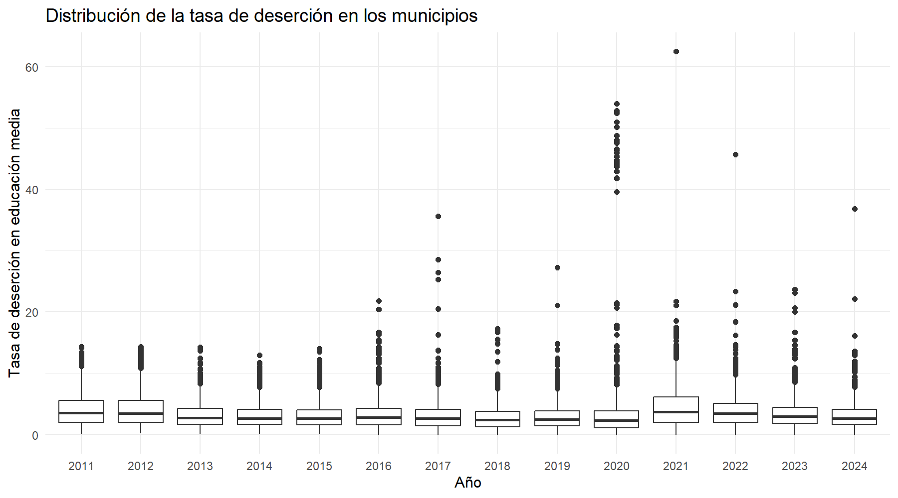
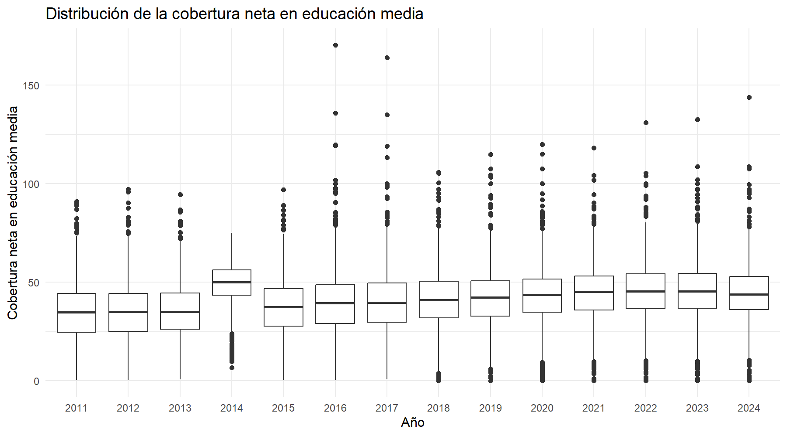
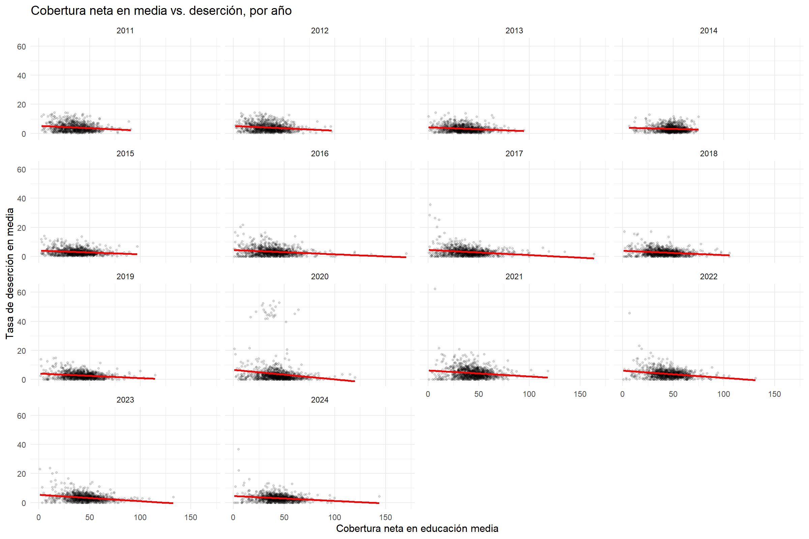
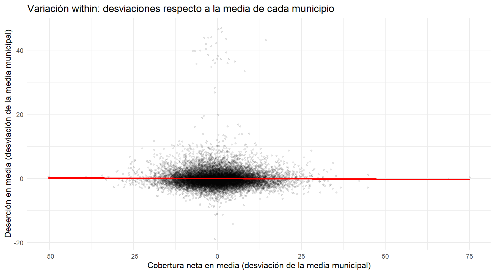
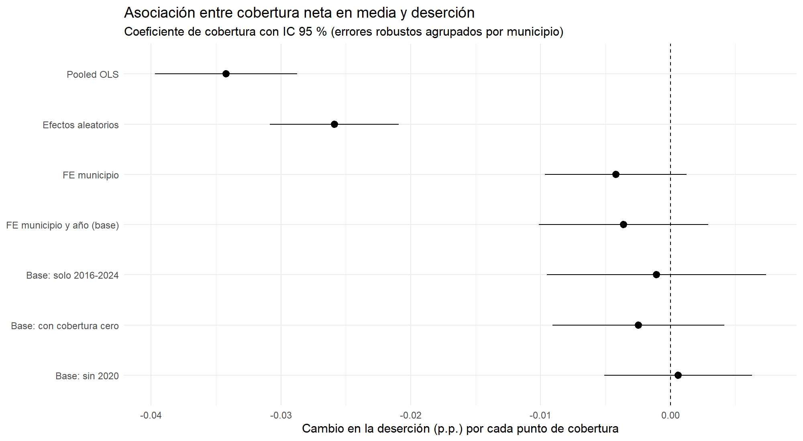
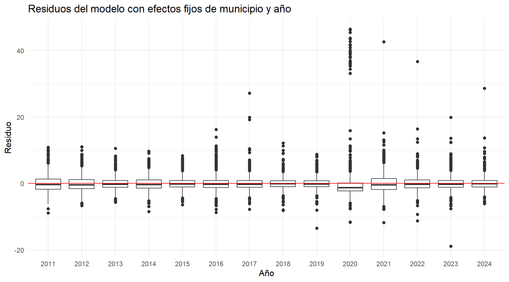

```{r setup, include=FALSE}
knitr::opts_chunk$set(echo = FALSE, message = FALSE, warning = FALSE)

# Formato con coma decimal, para números que se imprimen desde R
f <- function(x, d = 4) formatC(x, format = "f", digits = d, decimal.mark = ",")
```

Este trabajo estudia la relación entre la cobertura neta en educación media y la tasa de deserción en ese mismo nivel, usando un panel de municipios colombianos entre 2011 y 2024 construido con datos abiertos del Ministerio de Educación Nacional. Los modelos que usan variación entre municipios (mínimos cuadrados agrupados y efectos aleatorios) muestran una asociación negativa y estadísticamente significativa: a mayor cobertura, menor deserción. Sin embargo, cuando se compara cada municipio solo consigo mismo a lo largo del tiempo (efectos fijos de municipio y de año), el coeficiente se reduce aproximadamente un 89 % y deja de distinguirse de cero. Este resultado se mantiene al restringir la muestra a 2016-2024, al incluir observaciones con cobertura igual a cero y al excluir el año 2020. La lectura del trabajo es que la asociación observada entre municipios refleja sobre todo diferencias estructurales entre ellos, y que dentro de un mismo municipio no se detecta una relación entre los cambios de cobertura y los de deserción. Se trata de asociaciones y no de efectos causales. El informe sigue el orden de las tres partes del trabajo: la elección del dataset y de la técnica, el análisis exploratorio de los datos, y la estimación e interpretación de los modelos.

# Parte 1. Elección del dataset y de la técnica

## 1.1 El dataset y la pregunta de investigación

Los datos provienen de *Estadísticas en Educación en Preescolar, Básica y Media*, un dataset publicado por el Ministerio de Educación Nacional (MEN) en el portal de Datos Abiertos de Colombia. Se obtuvieron en formato CSV desde [https://www.datos.gov.co/resource/nudc-7mev.csv](https://www.datos.gov.co/resource/nudc-7mev.csv) (identificador `nudc-7mev`; consultado en septiembre de 2026).

Cada fila describe un municipio en un año, entre 2011 y 2024, e incluye indicadores como coberturas netas y brutas por nivel educativo, tasas de deserción, aprobación, reprobación y repitencia, tamaño promedio de grupo, población de 5 a 16 años y sedes conectadas a internet. En su versión descargada tiene 15.707 filas y 41 columnas. De todas esas variables, este trabajo usa dos: la **tasa de deserción en educación media**, que es la variable que se quiere entender, y la **cobertura neta en educación media**, que es la variable con la que se la relaciona. En términos generales, la cobertura neta mide qué proporción de la población en edad de cursar la educación media está matriculada en ese nivel, y la tasa de deserción mide qué proporción de los estudiantes matriculados abandona los estudios. Ambas se expresan en porcentaje.

Se eligió este dataset porque plantea una pregunta con relevancia de política pública. Ampliar el acceso a la educación media y lograr que los estudiantes permanezcan en ella son objetivos distintos, y interesa saber si en la práctica avanzan juntos. Además, la estructura de los datos, con más de mil municipios observados durante catorce años, es pertinente para los datos de panel. La pregunta de investigación es:

> **¿Cuál es la relación entre la cobertura neta en educación media y la tasa de deserción escolar en los municipios de Colombia entre 2011 y 2024?**

La pregunta está formulada en términos de relación y no de efecto, porque ni el diseño ni los datos permiten, por sí solos, sostener una interpretación causal; por eso, a lo largo del informe se habla de asociación. Para responderla hacía falta elegir una técnica coherente con la estructura de los datos, que es lo que se discute a continuación.

## 1.2 La técnica: datos de panel

La unidad de análisis es el municipio-año, es decir, cada municipio observado en cada año. Se aplican modelos de datos de panel con el paquete `plm` de R, por tres razones. Primero, hay muchas unidades (más de mil municipios) observadas repetidamente, así que una serie de tiempo única no aprovecharía la información. Segundo, las dos variables centrales son continuas, por lo que una regresión logística no corresponde. Tercero, la pregunta es sobre asociación y no sobre predicción, así que los métodos de regularización no son el instrumento natural.

La ventaja principal del panel es que permite separar dos fuentes de variación: la que existe *entre* municipios (unos tienen sistemáticamente más cobertura y menos deserción que otros) y la que existe *dentro* de cada municipio a lo largo del tiempo. Esa distinción es central en este trabajo, y se apoya en tres tipos de modelo. El modelo *agrupado* (*pooled*) ignora que los datos son un panel y mezcla ambas fuentes de variación. El modelo de *efectos fijos* le da a cada municipio su propio nivel de partida, de modo que cada municipio se compara solo consigo mismo a lo largo del tiempo, lo que controla cualquier característica del municipio que no cambie en el período, sea observada o no. El modelo de *efectos aleatorios* trata esas diferencias entre municipios como aleatorias y las supone no relacionadas con la cobertura, un supuesto más fuerte que se contrasta con el test de Hausman. Finalmente, los efectos fijos de año absorben los movimientos que afectan a todos los municipios por igual en un año dado.

La especificación de referencia es:

Deserción<sub>it</sub> = β · Cobertura<sub>it</sub> + α<sub>i</sub> + λ<sub>t</sub> + ε<sub>it</sub>

donde *i* indexa municipios y *t* años, α<sub>i</sub> es un efecto fijo de municipio, λ<sub>t</sub> es un efecto fijo de año y ε<sub>it</sub> es el error. El coeficiente β es el que responde a la pregunta de investigación. No se incluyeron controles adicionales, y las consecuencias de esa decisión se discuten en las limitaciones.

Con este diseño, lo que se espera aprender es si la asociación entre cobertura y deserción que aparece al comparar municipios se mantiene cuando cada municipio se compara consigo mismo. Antes de estimar, sin embargo, había que entender la estructura y la calidad de los datos, lo que se hace en la Parte 2.

# Parte 2. Análisis exploratorio de datos

El análisis exploratorio tuvo cuatro objetivos: entender la estructura del panel, caracterizar los valores faltantes, examinar las distribuciones de las dos variables centrales identificando los valores atípicos, y estudiar la relación entre ellas. En cada caso se documentan las decisiones tomadas y su justificación, que en conjunto definen la muestra con la que se estiman los modelos de la Parte 3. La tabla siguiente resume las variables que se usan, con el tipo con que se leyeron y el tratamiento aplicado. El dataset completo tiene 41 columnas, y la mayoría no se emplea en los modelos.

**Tabla 1. Variables utilizadas en el análisis**

| Variable | Tipo | Unidad o contenido | Tratamiento |
|:---|:---|:---|:---|
| Código del municipio | texto | identificador municipal | Estandarizado a cinco dígitos |
| Municipio y departamento | texto | nombres | Sin cambios |
| Año | numérico | 2011 a 2024 | Sin cambios; junto con el código forma el índice del panel |
| Cobertura neta en educación media | numérico | porcentaje | Sin cambios; faltantes y ceros según se explica más abajo |
| Deserción en educación media | numérico | porcentaje | Sin cambios; faltantes según se explica más abajo |
| Población de 5 a 16 años | texto al leerla, luego numérico | personas | Se eliminan los separadores; no se usa en los modelos |

**Estructura del panel.** Antes de modelar hubo que auditar la estructura del panel. Se encontraron tres problemas de formato o de composición de los datos que, de no corregirse, habrían distorsionado el análisis, y un rasgo estructural que condiciona la estimación.

*Códigos municipales inconsistentes.* El código del municipio venía como texto, y algunos códigos aparecían con cuatro dígitos (por ejemplo 8849) y otros con cinco (08849) para el mismo municipio. Sin corregirlo, un mismo municipio se contaba como dos y el panel quedaba artificialmente fragmentado. Se estandarizaron todos los códigos a cinco dígitos. Tras la corrección no queda ningún duplicado municipio-año.

*Un agregado nacional mezclado con los municipios.* Tres filas, con código "0", corresponden al total nacional y no a un municipio. Se excluyeron del panel municipal. Con esto el panel tiene 15.704 observaciones, 1.123 municipios y 14 años.

*Población con formatos mezclados.* La población de 5 a 16 años traía separadores de miles heterogéneos (puntos y comas), por lo que una lectura automática la interpretaba mal. Se leyó como texto y se convirtió a número eliminando los separadores. Quedaron seis valores faltantes, que no se imputaron. Esta variable finalmente no se usa en los modelos.

*Un panel no balanceado.* Hay 1.121 municipios observados los 14 años, más dos casos especiales que no se forzaron a encajar. Nuevo Belén de Bajirá (Chocó) aparece solo en 2024, y Mapiripana (Guainía) aparece entre 2011 y 2019 y luego desaparece. No se eliminaron ni se reasignaron a otros municipios para "balancear" el panel, porque hacerlo habría implicado inventar una continuidad que los datos no muestran. El paquete `plm` trabaja sin problema con paneles no balanceados.

**Valores faltantes.** Resuelta la estructura, el siguiente problema fueron los valores faltantes, que resultaron ser más que un detalle técnico: presentan un patrón sistemático en el tiempo y entre territorios. La tabla siguiente resume, por año, cuántas observaciones tienen faltantes o ceros en las dos variables centrales y cuántas quedan disponibles para estimar.

```{r tabla-faltantes}
tf <- read.csv("../outputs/tablas/faltantes_por_anio.csv")
tabla_f <- data.frame(
  "Año" = tf$a_o,
  "Observaciones" = tf$n_observaciones,
  "Deserción sin dato" = tf$desercion_na,
  "Cobertura sin dato" = tf$cobertura_na,
  "Cobertura igual a cero" = tf$n_cobertura_cero,
  "Muestra de estimación" = tf$muestra_estimacion,
  check.names = FALSE
)
knitr::kable(tabla_f, align = "rrrrrr", caption = "Tabla 2. Faltantes, ceros y muestra de estimación por año")
```

La tabla muestra tres hechos. *La deserción sin dato se concentra en 2011-2015.* De las 734 observaciones sin dato de deserción, 709 (cerca del 97 %) caen en esos cinco años, con un máximo de 210 en 2011. Desde 2016 casi desaparecen, y desde 2021 no hay ninguna. Es un patrón sistemático en el tiempo, y el dataset no incluye información que permita establecer su causa.

*La cobertura sin dato también está en los primeros años.* Las 93 observaciones sin dato de cobertura neta en media están entre 2011 y 2017. De ellas, 62 pertenecen a doce unidades de Amazonas, Guainía y Vaupés, y las otras 31 a doce unidades distintas, todas entre 2011 y 2015. En 14 de esas 31 filas sí hay dato de deserción, y varias corresponden a municipios que en otros años tienen coberturas superiores a 100 (Cota, Puerto Colombia, Panqueba, Puente Nacional). La concentración de estos faltantes en determinados territorios y años impide asumir que su ausencia sea irrelevante para la composición de la muestra. No se imputaron, porque no se cuenta con información adicional que permita reconstruirlos de manera confiable. El efecto práctico sobre la estimación es pequeño, porque son 14 filas.

*Aparecen además ceros de cobertura desde 2018.* Son 57 observaciones con cobertura neta en media igual a cero, todas de 2018 en adelante, y concentradas en doce unidades de Amazonas, Guainía y Vaupés. En varias de ellas la deserción figura sin dato o en cero. Cinco de las doce unidades (La Victoria, Puerto Alegría, Cacahual, La Guadalupe y Papunaua) no tienen ningún dato utilizable en los catorce años. Este patrón permite sospechar que el cero puede indicar ausencia de matrícula observable en educación media, pero los datos no permiten confirmarlo.

**Decisiones sobre faltantes y ceros.** No se imputó ningún valor. Las observaciones con cobertura o deserción sin dato salen de la estimación por eliminación de casos incompletos. Las 57 observaciones con cobertura igual a cero se marcaron con una bandera y se excluyeron de la estimación principal, porque su interpretación como una cobertura efectivamente igual a cero no resulta clara con la información disponible. Representan el 0,4 % de la muestra, y se comprueba más adelante que la conclusión no depende de esta decisión. La muestra de estimación queda en 14.908 observaciones (94,9 % del total) y 1.118 municipios, ya que los cinco sin datos utilizables quedan fuera.

**Distribuciones y valores atípicos.** Con las reglas sobre faltantes definidas, se examinan las distribuciones de las dos variables centrales. Las Figuras 1 y 2 se calculan sobre el panel completo, antes de excluir observaciones, para no ocultar ningún valor extremo.

```{r fig-desercion, out.width="100%", fig.cap="Figura 1. Distribución de la tasa de deserción en educación media, por año."}

```

La tasa de deserción tiene una fuerte asimetría positiva. La mediana general es 2,83 % y el percentil 99 es 12,9 %, pero el máximo llega a 62,5 %. Hay 371 observaciones por encima de 10, 49 por encima de 20 y 27 por encima de 40. Los valores extremos se concentran en 2020: 29 de las 49 observaciones por encima de 20 corresponden a ese año, y ocho de los diez valores más altos de todo el panel son municipios del Cesar en 2020. El máximo absoluto (62,5 %) es Morichal (Guainía) en 2021. No se atribuye este patrón a ninguna causa en particular, como la pandemia, porque los datos no permiten sostenerlo. No se eliminaron, recortaron ni winsorizaron estos valores. No hay razón para pensar que sean errores de registro, y en municipios muy pequeños, como Morichal, pocos estudiantes mueven la tasa varios puntos. En cambio, se evalúa cuánto influyen mediante una prueba de robustez que excluye 2020.

```{r fig-cobertura, out.width="100%", fig.cap="Figura 2. Distribución de la cobertura neta en educación media, por año."}

```

La cobertura neta en media tiene una mediana de 41,4 % y un rango intercuartílico de 31,4 % a 50,7 %. Hay 31 observaciones por encima de 100 y 7 por encima de 120, con un máximo de 170 (Puerto Colombia, Atlántico, 2016). Una cobertura neta superior a 100 resulta atípica para la interpretación habitual de una tasa de cobertura y requiere cautela al interpretarla. Con la información disponible no se pudo establecer su origen. Se mantuvieron estas observaciones, porque no hay evidencia de que sean errores y su exclusión sería arbitraria. Son pocas y son puntos de alto apalancamiento en la cola derecha, por lo que se tienen presentes al interpretar las rectas.

La Figura 2 muestra además un salto llamativo de la mediana en 2014 (cerca de 50 %, frente a valores de 35 % a 37 % en los años vecinos) seguido de una caída en 2015. Un salto tan puntual y transitorio sería difícil de interpretar como un cambio sustantivo; podría estar asociado a la medición, aunque esto no se verificó. Con la información disponible no se puede establecer la causa, y se deja como una limitación. Este hallazgo, junto con la concentración de faltantes en los primeros años, motiva una de las pruebas de robustez de la Parte 3.

**Relación entre cobertura y deserción.** Descritas las variables por separado, se pasa a su relación. Las Figuras 3 y 4 usan ya la muestra de estimación.

```{r fig-dispersion, out.width="100%", fig.cap="Figura 3. Cobertura neta en media vs. deserción, por año, con recta de ajuste lineal."}

```

Al graficar la relación año por año se ve una pendiente negativa en los catorce años, con valores de deserción de alrededor de 5 puntos con cobertura baja y de 1 a 2 puntos con cobertura alta. No hay inversiones de signo entre años. Además, la dispersión de la deserción es mucho mayor cuando la cobertura es baja (forma de abanico), lo que anticipa heterocedasticidad y motiva el uso de errores estándar robustos. En 2020 destaca el grupo de deserciones extremas, y en algunos años la recta lineal cruza por debajo de cero con coberturas altas, algo imposible para una tasa, lo que recuerda que el ajuste lineal es solo una aproximación. Sin embargo, este gráfico compara municipios distintos entre sí dentro de cada año, y no dice nada sobre qué ocurre dentro de un mismo municipio a lo largo del tiempo, que es lo que el panel permite estudiar.

```{r fig-within, out.width="100%", fig.cap="Figura 4. Variación within: desviaciones de cobertura y deserción respecto de la media de cada municipio."}

```

La Figura 4 resta a cada municipio su propia media en ambas variables, de modo que solo queda la variación a lo largo del tiempo dentro de cada uno. La pendiente es prácticamente plana. Es decir, la relación negativa que se ve en la Figura 3 proviene sobre todo de diferencias *entre* municipios, y casi no aparece cuando cada municipio se compara consigo mismo. Los puntos altos cercanos al centro del eje horizontal son los casos extremos de deserción, cuya cobertura no varió mucho respecto de su media.

**Qué se concluye del análisis exploratorio.** El análisis deja cuatro resultados que orientan la estimación. Primero, la muestra de estimación es de 14.908 observaciones de 1.118 municipios, construida sin imputar valores y con reglas explícitas para faltantes y ceros. Segundo, los valores extremos de deserción y de cobertura se mantienen en los datos, y su influencia se evalúa con pruebas de robustez. Tercero, la relación negativa entre cobertura y deserción parece provenir de la comparación entre municipios y no de su evolución en el tiempo, por lo que cabe esperar que los modelos que usan una u otra fuente de variación den resultados muy distintos. Cuarto, la dispersión desigual de la deserción y las dudas sobre la calidad de los primeros años justifican el uso de errores estándar robustos y una prueba restringida a 2016-2024.

# Parte 3. Aplicación de la técnica e interpretación

Con la muestra definida, se estimó la secuencia de modelos descrita en la Parte 1. Primero, el modelo agrupado, que mezcla las dos fuentes de variación. Segundo, el de efectos fijos de municipio, que usa solo la variación dentro de cada municipio, y el de efectos aleatorios. La elección entre estos dos últimos se hizo con el test de Hausman, que evalúa si las diferencias permanentes entre municipios están relacionadas con la cobertura. Finalmente se agregaron efectos fijos de año, y un test F de significancia conjunta, disponible en el paquete `plm`, evaluó si aportan sobre los efectos fijos de municipio. Todas las estimaciones usan la muestra de 14.908 observaciones, salvo las variantes de robustez, que la modifican de manera explícita.

En todos los modelos la inferencia usa errores estándar robustos de tipo HC1 agrupados por municipio. Esto significa que los errores estándar no suponen una varianza constante de los errores y permiten que los errores de un mismo municipio estén relacionados entre años, lo que es razonable en un panel. La heterocedasticidad se observa en los gráficos exploratorios; no se realizaron pruebas formales de correlación serial. La tabla y la figura siguientes resumen los resultados de todas las especificaciones.

```{r tabla-coefs}
cf <- read.csv("../outputs/tablas/coeficientes_modelos.csv")
tabla_c <- data.frame(
  "Modelo" = cf$modelo,
  "Coeficiente de cobertura" = f(cf$estimate),
  "Error estándar" = f(cf$se),
  "IC 95 %" = paste0("[", f(cf$lo), "; ", f(cf$hi), "]"),
  "Valor p" = ifelse(cf$p_valor < 0.001, "< 0,001", f(cf$p_valor, 2)),
  check.names = FALSE
)
knitr::kable(tabla_c, align = "lrrrr", caption = "Tabla 3. Coeficiente de cobertura neta en media sobre la deserción, por modelo (errores robustos agrupados por municipio)")
```

```{r fig-coefs, out.width="100%", fig.cap="Figura 5. Coeficiente de cobertura con intervalo de confianza del 95 % en cada especificación."}

```

**Resultados con variación entre municipios.** El modelo agrupado estima un coeficiente de -0,034: diez puntos porcentuales más de cobertura se asocian con unos 0,34 puntos porcentuales menos de deserción. El modelo de efectos aleatorios da -0,026. Ambos son estadísticamente significativos, pero ambos incorporan la variación entre municipios, que es justamente la que la Figura 4 mostraba como fuente de la relación negativa.

**Elección entre efectos fijos y aleatorios.** Para decidir cuál de las dos especificaciones es adecuada, se recurre al test de Hausman. Este rechaza con claridad que el modelo de efectos aleatorios sea consistente (χ² = 99,55; 1 grado de libertad; p < 0,001). El resultado es consistente con la presencia de correlación entre los efectos individuales no observados y la cobertura, condición bajo la cual el estimador de efectos aleatorios no sería consistente. Por ello el análisis se centra en la especificación de efectos fijos, elección que se apoya en el test y no en una preferencia previa. Se usó la versión estándar del test, que supone errores homocedásticos; no se calculó una versión robusta.

**Resultados con variación dentro de cada municipio.** Con efectos fijos de municipio, el coeficiente cae a -0,0042 (p = 0,13). Al agregar efectos fijos de año, que resultan conjuntamente significativos (F = 33,25; p < 0,001), el coeficiente es -0,0036 con un intervalo de confianza del 95 % de [-0,0101; 0,0029]. Esta es la especificación base. El intervalo incluye el cero, pero deja muy por fuera al coeficiente del modelo agrupado. En términos de magnitud, la cota inferior del intervalo implicaría como máximo unos 0,10 puntos porcentuales menos de deserción por cada diez puntos de cobertura, frente a 0,34 en el modelo agrupado.

**Ajuste del modelo.** El R² within del modelo base es de 0,00008. Este indicador mide qué parte de la variación de la deserción, una vez descontados los efectos fijos de municipio y de año, es explicada por la cobertura, y su valor es prácticamente nulo: esta especificación tiene muy poca capacidad explicativa de la variación within. El R² ajustado resulta negativo, algo que puede ocurrir cuando el regresor no aporta y el ajuste penaliza los numerosos parámetros de los efectos fijos. Ambos valores son coherentes con el coeficiente cercano a cero.

**Diagnóstico: variación disponible.** Un coeficiente de efectos fijos cercano a cero podría deberse a que no hay relación, pero también a que la cobertura casi no cambia dentro de cada municipio y, por lo tanto, no hay variación con la cual identificarlo. Para descartar esto último se calculó la desviación estándar de la cobertura dentro de cada municipio, para los que tienen más de una observación.

```{r within-diag}
dw <- read.csv("../outputs/tablas/diagnostico_variacion_within.csv")
```

La mediana de esa desviación estándar es de `r f(dw$sd_within_mediana, 1)` puntos porcentuales, con un rango intercuartílico de `r f(dw$sd_within_p25, 1)` a `r f(dw$sd_within_p75, 1)`, frente a una desviación estándar total de `r f(dw$sd_total, 1)`. La cobertura de un municipio típico se mueve de manera apreciable a lo largo del tiempo, y el resultado del modelo no se explica por falta de variación within. Este indicador no distingue, sin embargo, entre variación genuina y error de medición, una limitación que se discute más abajo.

**Diagnóstico: residuos.** También se revisaron los residuos del modelo base, para ver si algún año o grupo de observaciones se comporta de manera distinta.

```{r fig-residuos, out.width="100%", fig.cap="Figura 6. Residuos del modelo con efectos fijos de municipio y año, por año."}

```

Los residuos están centrados en cero y son bastante simétricos en la mayoría de los años, pero tienen colas largas hacia arriba y una dispersión mayor en 2020 y 2021. En 2020 aparece un grupo de residuos de entre 33 y 46 puntos, que corresponde a los casos extremos ya descritos. Los residuos se apartan claramente de la normalidad (colas pesadas) y su dispersión cambia entre años, por lo que la inferencia se apoya en errores estándar robustos y agrupados y no en supuestos de normalidad. Estos errores no corrigen por sí mismos el efecto de unos pocos puntos muy influyentes, y por eso se incluye la prueba de robustez que excluye 2020.

**Robustez.** Para evaluar si el resultado depende de las decisiones tomadas en la exploración, se re-estimó la especificación base en tres variantes, que corresponden a las tres preocupaciones identificadas en la Parte 2. Restringida a 2016-2024, años con pocos faltantes y sin el salto de 2014, el coeficiente es -0,0011 (p = 0,80). Incluyendo las observaciones con cobertura igual a cero, es -0,0025 (p = 0,47). Excluyendo 2020, es +0,0006 (p = 0,84). En los tres casos el coeficiente es indistinguible de cero, y ninguno se acerca a la magnitud del modelo agrupado. El paso de -0,0036 a +0,0006 al excluir 2020 es de algo más de un error estándar, y sugiere que parte de la leve pendiente negativa de la muestra completa puede deberse al grupo de deserciones extremas de ese año. No se interpreta más allá de eso, porque con esta precisión las diferencias entre variantes no son concluyentes.

**Interpretación sustantiva.** La pregunta era cuál es la relación entre la cobertura neta en educación media y la deserción. La respuesta tiene dos partes. *Entre municipios*, los que tienen mayor cobertura tienen, en promedio, menor deserción, y esta asociación es estadísticamente clara. *Dentro de cada municipio*, en cambio, los cambios de cobertura a lo largo del tiempo no vienen acompañados de cambios detectables en la deserción, una vez que se descuentan las diferencias permanentes entre municipios y los movimientos comunes a todos en cada año.

Una lectura posible es que la asociación agrupada refleje diferencias estructurales entre municipios, como las asociadas a urbanización, recursos u oferta educativa, factores que este modelo no mide, y no una relación que opere a través de los cambios de cobertura en el tiempo. Es una interpretación compatible con los resultados, y el trabajo no la demuestra. Tampoco puede afirmarse que la relación dentro de cada municipio sea exactamente cero: los intervalos de confianza incluyen valores pequeños de ambos signos. Lo que sí puede afirmarse es que un efecto within del tamaño de la asociación agrupada es incompatible con los datos.

## Limitaciones

Estos resultados deben leerse con las siguientes limitaciones.

- **No es causal.** Los resultados son asociaciones. Además, es posible una causalidad inversa: una deserción alta reduce la matrícula y, con ello, la cobertura neta observada. La técnica empleada no la resuelve.
- **Una especificación parsimoniosa.** El modelo no incluye controles que varíen en el tiempo. Cambios simultáneos en otras condiciones del municipio podrían mover ambas variables. La población de 5 a 16 años, disponible en el dataset, no se usó, porque no se justificó como control y podría estar mecánicamente relacionada con una cobertura definida sobre población.
- **Error de medición.** Hay indicios de problemas de medición en los primeros años (concentración de faltantes en 2011-2015 y el salto de 2014). El error de medición en una variable explicativa tiende a debilitar más al estimador within que al agrupado, de modo que podría contribuir al coeficiente cercano a cero. Esta es una hipótesis. La prueba con 2016-2024 apunta en el mismo sentido que la muestra completa, pero con menor precisión.
- **Faltantes con patrón sistemático.** La eliminación de casos incompletos es válida si los faltantes no dependen de los valores que se pierden. Dado que se concentran en ciertos años y territorios, no puede asumirse esa condición, y con la información disponible el mecanismo de ausencia no puede establecerse formalmente.
- **Unidades pequeñas y valores extremos.** En municipios con matrículas muy pequeñas, las tasas de deserción son volátiles, y unos pocos casos extremos tienen mucha influencia. La prueba sin 2020 lo aborda de forma parcial.
- **Relación lineal.** Las rectas ajustadas no respetan los límites de una tasa y no capturan posibles no linealidades.

## Datos y reproducibilidad

Los datos se obtuvieron del portal de Datos Abiertos de Colombia, en [https://www.datos.gov.co/resource/nudc-7mev.csv](https://www.datos.gov.co/resource/nudc-7mev.csv) (identificador `nudc-7mev`). El análisis completo está en tres scripts de R (`01_carga_limpieza.R`, `02_eda.R` y `03_modelos.R`) que se ejecutan en ese orden desde la raíz del proyecto, con semilla fija y rutas relativas. Los datos descargados se guardan localmente en la primera ejecución. El repositorio y las instrucciones detalladas están en el archivo `README.md`: [https://github.com/likamoal-svg/TP_R_UTDT].
